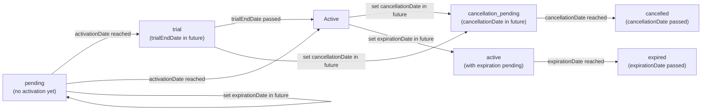

# Subscription Lifecycle Reference

This guide explains every subscription status exposed by `SubscriptionDto.status`, the exact calculation rules, and how statuses can flow over time. These rules are enforced inside the `Subscription` domain entity, so every fetch reflects the latest lifecycle state without requiring callers to run manual cron jobs or SQL scripts.

## Calculation Order

Statuses are evaluated in a strict priority order. The first rule that matches wins:

1. `cancelled`
2. `expired`
3. `trial`
4. `cancellation_pending`
5. `suspended`
6. `active`
7. `pending` (fallback when activation has not happened yet)

If two conditions could apply simultaneously, whichever appears earlier in the list takes precedence.

## Status Definitions

| Status | How it is calculated | Typical usage |
| --- | --- | --- |
| `pending` | Subscription exists but `activationDate` is missing or in the future. None of the other rules match yet. | Pre-provisioned subscriptions waiting for onboarding or payment confirmation. |
| `active` | Default state once `activationDate` is in the past and there are no cancellations, expirations, suspensions, or trials in play. | Normal billing periods after trial completion. |
| `trial` | `trialEndDate` exists and is greater than the current time. Overrides `active` as long as the trial is ongoing. | Limited-time access before billing starts. |
| `cancellation_pending` | `cancellationDate` is set (indicating the subscriber asked to cancel) but the current period end or cancellation date is still in the future. | Grace period between a cancellation request and the final cut-off. |
| `cancelled` | `cancellationDate` exists and is in the past (or equals now). Indicates the subscription has fully ended due to cancellation. | Final state after the cancellation effective date passes. |
| `expired` | `expirationDate` exists and is in the past, **and** there is no cancellation. Used for time-bound subscriptions that simply reach their expiration. | Fixed-term offers or promotional subscriptions that lapse automatically. |
| `suspended` | Subscription has been explicitly suspended via `suspend()` (e.g., payment failure or manual enforcement). This state only applies when none of the higher-priority rules match. | Temporary service pause until the issue is resolved. |

> **Important `cancellation_pending` and `cancelled` always win over `trial`, `active`, and `pending`. This ensures cancellation intent is honored regardless of trial or activation timing.

## Status Flow Diagram



The diagram illustrates common flows but does not represent every edge case (e.g., reactivation or plan transitions). Any state may move directly to `cancelled` or `expired` when the relevant date is set retroactively.

## Subscription Transitions

When a subscription expires and its plan has an `onExpireTransitionToBillingCycleKey` configured, the subscription can be automatically transitioned to a new plan. This is handled by the `transitionExpiredSubscriptions()` method.

### Transition Process

1. **Expired subscriptions** with transition-enabled plans are identified
2. **Old subscription** is marked as transitioned (archived with `transitioned_at` timestamp)
3. **New subscription** is created to the transition billing cycle
4. **Subscription key** is versioned: `original-key` → `original-key-v1` → `original-key-v2`, etc.

### Transition Tracking

- **`transitioned_at`**: UTC timestamp set when a subscription is transitioned
- **Archived status**: Transitioned subscriptions are archived (`isArchived = true`)
- **Stripe IDs**: Original Stripe subscription ID remains on the archived subscription for historical reference
- **Feature overrides**: Do not carry over to the new subscription
- **Metadata**: Carries over to the new subscription

### Querying Transitioned Subscriptions

To find all subscriptions that were transitioned:

```sql
SELECT * FROM subscrio.subscriptions 
WHERE transitioned_at IS NOT NULL;
```

Or filter by transition date range for auditing purposes.

## Best Practices for Provisioning Subscriptions with Trials

When creating subscriptions with trial periods, you need to decide what happens when the trial ends. There are three distinct scenarios, each requiring different configuration of `trialEndDate`, `expirationDate`, and `currentPeriodStart`/`currentPeriodEnd`.

### Understanding the Key Fields

- **`trialEndDate`**: Controls when the subscription is in `trial` status. If `trialEndDate > NOW()`, status is `trial`; otherwise it's `active` or `expired`.
- **`expirationDate`**: Controls when the subscription becomes `expired`. If set to the same value as `trialEndDate`, the subscription will expire when the trial ends.
- **`currentPeriodStart`** and **`currentPeriodEnd`**: Represent the billing period. **Best practice**: Set `currentPeriodStart` equal to `trialEndDate` so billing begins when the trial ends.

### Trial End Scenarios

| Scenario | `trialEndDate` | `expirationDate` | Plan Transition? | After Trial Ends |
|----------|----------------|------------------|------------------|------------------|
| **A: Billing starts** | Future date | `null` (not set) | No | Status: `active`, billing period begins |
| **B: Migrate to free plan** | Future date | = `trialEndDate` | Yes (`onExpireTransitionToBillingCycleKey`) | Status: `expired` → new subscription to free plan created |
| **C: Lose access** | Future date | = `trialEndDate` | No | Status: `expired`, no access granted |

### Scenario A: Trial Ends → Billing Starts (Normal Paid Subscription)

This is the standard flow for paid subscriptions with a trial period. When the trial ends, billing automatically begins.

#### Setup

```typescript
// Calculate trial end date (7 days from now)
const trialEndDate = new Date();
trialEndDate.setDate(trialEndDate.getDate() + 7);

// Create subscription
// Note: currentPeriodStart and currentPeriodEnd are optional
// If not provided, they will be calculated automatically
const subscription = await subscrio.subscriptions.createSubscription({
  key: 'customer-123-pro-subscription',
  customerKey: 'customer-123',
  billingCycleKey: 'pro-monthly', // Monthly billing cycle
  trialEndDate: trialEndDate.toISOString(),
  // expirationDate is NOT set - billing will start after trial
  // currentPeriodStart and currentPeriodEnd will be auto-calculated
  // to start when trial ends
});
```

#### Record State on Creation

```typescript
{
  trialEndDate: "2025-01-27T00:00:00Z",      // 7 days from now
  expirationDate: null,                      // NOT set
  currentPeriodStart: "2025-01-27T00:00:00Z", // Same as trialEndDate (billing starts when trial ends)
  currentPeriodEnd: "2025-02-27T00:00:00Z",   // currentPeriodStart + 1 month
  activationDate: "2025-01-20T00:00:00Z",    // Now
  status: "trial"                             // Because trialEndDate > NOW()
}
```

#### After Trial Ends (2025-01-27)

```typescript
{
  trialEndDate: "2025-01-27T00:00:00Z",      // Still set (historical record)
  expirationDate: null,                       // Still not set
  currentPeriodStart: "2025-01-27T00:00:00Z", // Billing period started
  currentPeriodEnd: "2025-02-27T00:00:00Z",   // First billing period ends
  status: "active"                            // trialEndDate <= NOW(), no expiration
}
```

The subscription is now in its first paid billing period. The customer will be charged and has full access.

---

### Scenario B: Trial Ends → Migrate to Free Plan

Use this when you want to automatically transition customers to a free plan after their trial expires. This requires setting up the transition on the plan.

#### Plan Setup (One-Time)

First, configure the paid plan to transition to a free plan when subscriptions expire:

```typescript
// Create or update the paid plan to specify transition target
const paidPlan = await subscrio.plans.createPlan({
  productKey: 'my-product',
  key: 'pro-plan',
  displayName: 'Pro Plan',
  // ... other fields
});

// The plan should have onExpireTransitionToBillingCycleKey set
// This is typically set when creating the plan or via plan management
// For this example, assume 'free-monthly' billing cycle exists for the free plan
```

> **Note**: The `onExpireTransitionToBillingCycleKey` field is set on the plan entity. You'll need to ensure your plan has this configured, either through your plan creation process or by updating existing plans.

#### Subscription Creation

```typescript
// Calculate trial end date (14 days from now)
const trialEndDate = new Date();
trialEndDate.setDate(trialEndDate.getDate() + 14);

// Create subscription with expiration set to trial end
const subscription = await subscrio.subscriptions.createSubscription({
  key: 'customer-123-pro-trial',
  customerKey: 'customer-123',
  billingCycleKey: 'pro-monthly', // Paid plan billing cycle
  trialEndDate: trialEndDate.toISOString(),
  expirationDate: trialEndDate.toISOString(), // Same as trialEndDate - expires when trial ends
  // currentPeriodStart will be set to trialEndDate automatically
});
```

#### Record State on Creation

```typescript
{
  trialEndDate: "2025-02-03T00:00:00Z",      // 14 days from now
  expirationDate: "2025-02-03T00:00:00Z",    // Same as trialEndDate
  currentPeriodStart: "2025-02-03T00:00:00Z", // Would start billing here, but expires instead
  currentPeriodEnd: "2025-03-03T00:00:00Z",
  status: "trial"                             // trialEndDate > NOW()
}
```

#### After Trial Ends (2025-02-03)

The subscription status becomes `expired` because `expirationDate <= NOW()`. To trigger the transition to the free plan, run the transition process:

```typescript
// Run this periodically (e.g., via cron job) to process expired subscriptions
const report = await subscrio.subscriptions.transitionExpiredSubscriptions();

console.log(`Processed: ${report.processed}`);
console.log(`Transitioned: ${report.transitioned}`);
console.log(`Errors: ${report.errors.length}`);
```

#### What Happens During Transition

1. **Old subscription** is archived and marked with `transitioned_at` timestamp
2. **New subscription** is created to the free plan's billing cycle
3. **Subscription key** is versioned: `customer-123-pro-trial` → `customer-123-pro-trial-v1`
4. **Metadata** carries over to the new subscription
5. **Feature overrides** do NOT carry over
6. **Stripe subscription ID** remains on the old archived subscription

The new subscription will have:
```typescript
{
  key: "customer-123-pro-trial-v1",
  billingCycleKey: "free-monthly", // Transitioned to free plan
  trialEndDate: null,               // No trial on free plan
  expirationDate: null,              // Free plan doesn't expire
  status: "active"                   // Immediately active
}
```

---

### Scenario C: Trial Ends → Lose Access

Use this when you want customers to lose access completely after the trial ends, with no automatic transition to another plan.

#### Setup

```typescript
// Calculate trial end date (7 days from now)
const trialEndDate = new Date();
trialEndDate.setDate(trialEndDate.getDate() + 7);

// Create subscription with expiration
const subscription = await subscrio.subscriptions.createSubscription({
  key: 'customer-123-trial-only',
  customerKey: 'customer-123',
  billingCycleKey: 'premium-monthly',
  trialEndDate: trialEndDate.toISOString(),
  expirationDate: trialEndDate.toISOString(), // Same as trialEndDate - expires when trial ends
  // Plan does NOT have onExpireTransitionToBillingCycleKey set
});
```

#### Record State on Creation

```typescript
{
  trialEndDate: "2025-01-27T00:00:00Z",      // 7 days from now
  expirationDate: "2025-01-27T00:00:00Z",    // Same as trialEndDate
  currentPeriodStart: "2025-01-27T00:00:00Z",
  currentPeriodEnd: "2025-02-27T00:00:00Z",
  status: "trial"                             // trialEndDate > NOW()
}
```

#### After Trial Ends (2025-01-27)

```typescript
{
  trialEndDate: "2025-01-27T00:00:00Z",      // Historical record
  expirationDate: "2025-01-27T00:00:00Z",    // Now in the past
  status: "expired"                          // expirationDate <= NOW()
}
```

The customer loses access. The subscription remains in the database as `expired` for historical purposes, but the feature checker will return no access.

---

### Important Notes

1. **`currentPeriodStart` Best Practice**: When `trialEndDate` is provided, set `currentPeriodStart` equal to `trialEndDate` so the billing period begins when the trial ends. If you don't explicitly set `currentPeriodStart`, Subscrio will calculate it based on the billing cycle, but explicitly setting it to `trialEndDate` makes the intent clear.

2. **Billing System Integration**: When integrating with external billing systems (like Stripe), the billing system will typically reset all dates when a customer purchases during trial. In this case, you should update the subscription with the dates provided by the billing system webhook.

3. **Running Transitions**: For Scenario B (migrate to free plan), you must periodically call `transitionExpiredSubscriptions()` to process expired subscriptions. This is typically done via a cron job or scheduled task.

4. **Status Priority**: Remember that `expired` status (priority 2) takes precedence over `trial` status (priority 3). If both `trialEndDate` and `expirationDate` are set to the same future date, the subscription will be `trial` until that date, then immediately become `expired`.

5. **Explicit vs Calculated Dates**: You can either explicitly set `currentPeriodStart` and `currentPeriodEnd`, or let Subscrio calculate them. If you set `trialEndDate` but don't set `currentPeriodStart`, Subscrio will use `now()` as the start, which may not be what you want. **Recommendation**: Always explicitly set `currentPeriodStart` to `trialEndDate` when creating trial subscriptions.

## Practical Tips

- Setting `trialEndDate` automatically enters `trial` until the timestamp is reached. Remove or backdate the field to exit trial immediately.
- To stage a future cancellation, set `cancellationDate` to the end of the current period. The subscription becomes `cancellation_pending` until the date passes.
- Removing `cancellationDate` (e.g., a customer rescinds cancellation) returns the subscription to `active` or `trial`, depending on other fields.
- `suspended` is only set via explicit service calls (e.g., billing failure automation). Once you call `resume()`, the entity recomputes to whichever status applies next (`active`, `trial`, etc.).

Refer back to `subscriptions.md` for lifecycle-related APIs (`archiveSubscription`, `unarchiveSubscription`, `clearTemporaryOverrides`, etc.), and to `feature-checker.md` for how these statuses affect runtime feature access.
